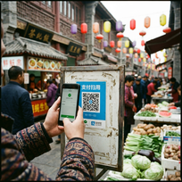

# 中国的手机支付

如果你去中国旅游，你会发现很有一意思的事情：大家都不带现金 (cash)。

## 微信和支付宝 (WeChat and Alipay)

在中国，最流行的两个支付APP是：
1. **微信支付 (WeChat Pay)**
2. **支付宝 (Alipay)**

不管是大超市，还是路边卖水果的老奶奶，都有自己的收款二维码 (QR Code)。

## 怎么用？

很简单！
1. 打开手机APP。
2. "扫一扫" (Scan) 商家的二维码。
3. 输入密码，就完成了！

或者，让商家扫你的手机也可以。

## 抢红包 (Red Packets)

过春节的时候，大家会在手机上发"红包"。

虽然钱不多，可能只有几块钱，但是大家都觉得很好玩。这也是一种新的祝福方式。

---

一部手机，走遍中国。这就是现在的"中国速度"。

---

**生词 (New Words):**
- 手机 (shǒujī) - mobile phone
- 支付 (zhīfù) - to pay/payment
- 旅游 (lǚyóu) - travel
- 发现 (fāxiàn) - discover
- 现金 (xiànjīn) - cash
- 流行 (liúxíng) - popular
- 无论 (wúlùn) - no matter...
- 二维码 (èrwéimǎ) - QR code
- 简单 (jiǎndān) - simple
- 商家 (shāngjiā) - merchant/shop
- 抢 (qiǎng) - to snatch/grab
- 红包 (hóngbāo) - red packet (money gift)
- 祝福 (zhùfú) - blessing

