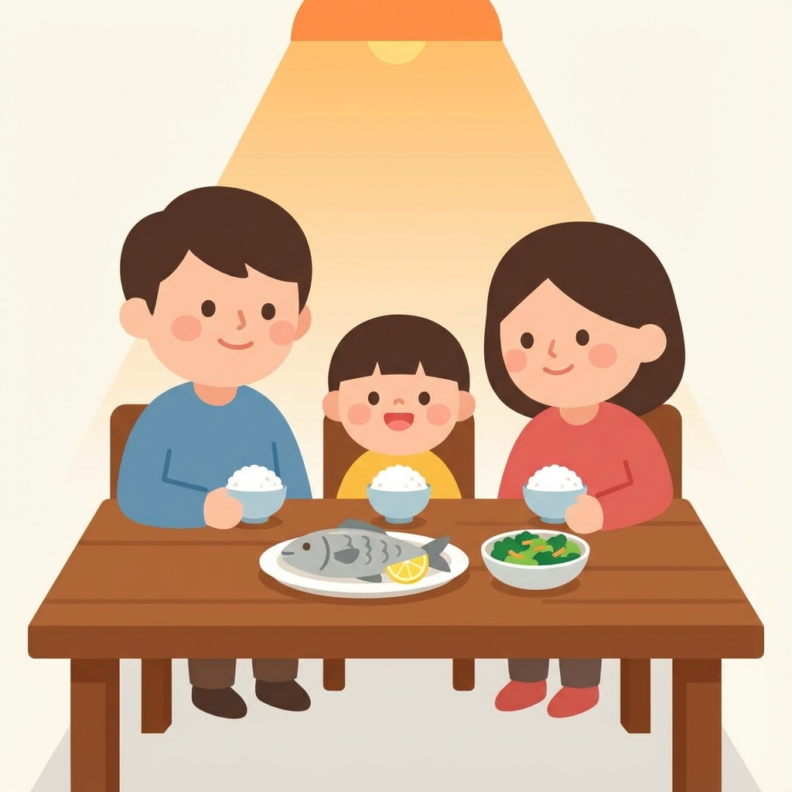

# 吃晚饭

晚上七点，我们吃晚饭。

今天有米饭，有鱼，还有青菜。

爸爸喜欢吃鱼。妈妈做的鱼很好吃。

我不喜欢吃青菜，但是妈妈说："吃青菜对身体好。"

我们大家都吃了很多。

晚饭后，我们吃水果。西瓜很甜。

---

**生词 (New Words):**
- 晚饭 (wǎnfàn) - dinner
- 晚上 (wǎnshang) - evening
- 七点 (qī diǎn) - 7 o'clock
- 米饭 (mǐfàn) - cooked rice
- 鱼 (yú) - fish
- 青菜 (qīngcài) - green vegetables
- 做 (zuò) - to make/cook
- 好吃 (hǎochī) - delicious
- 身体 (shēntǐ) - body/health
- 水果 (shuǐguǒ) - fruit
- 西瓜 (xīguā) - watermelon
- 甜 (tián) - sweet

